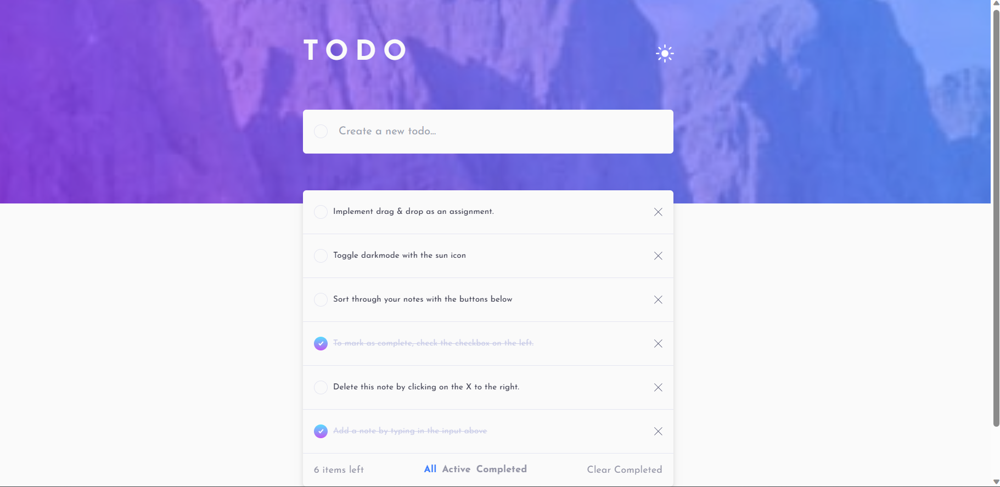
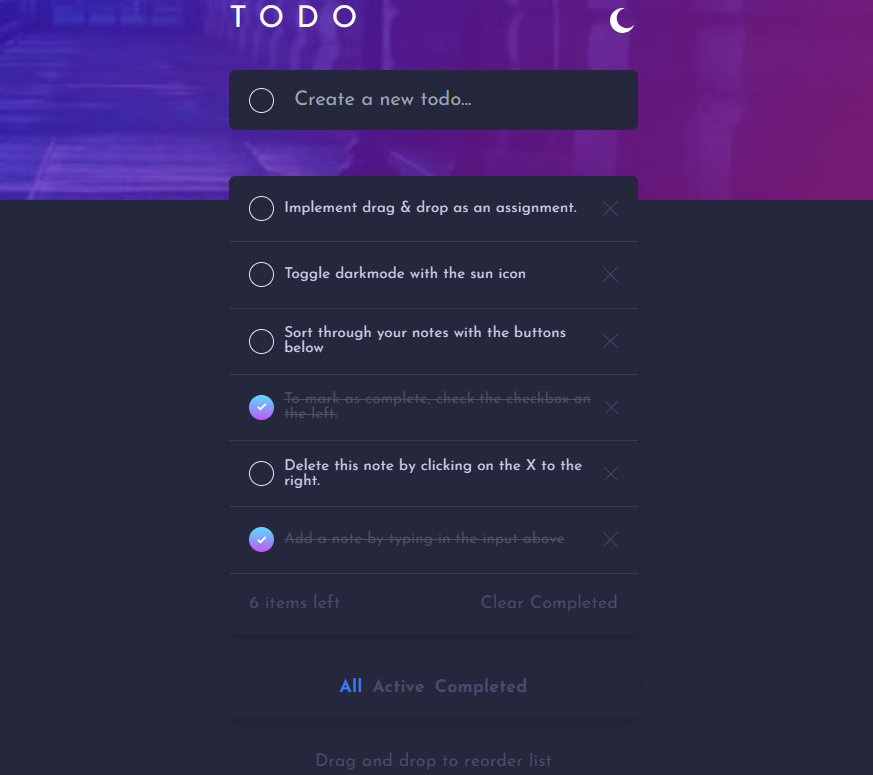

# Todo app solution

## Table of contents

- [Overview](#overview)
  - [Screenshot](#screenshot)
  - [Links](#links)
- [My process](#my-process)
  - [Built with](#built-with)
- [Author](#author)

## Overview

This is a simple Todo app built using TypeScript, Next.js 13, and Tailwind CSS. The app allows users to create, update, and delete todos. It also includes a filter option to view todos based on their completion status.

### Screenshot

### Links

- Solution URL: [View code on GitHub](https://github.com/mikenjuki/ToDo-app-v1)
- Live Site URL: [Live Site here](https://to-do-app-v1-1335qi3hp-mikenjuki.vercel.app/)

## My process

I started by setting up the project structure and installing the necessary dependencies. Then, I created the basic layout of the app using Tailwind CSS classes.

Next, I implemented the context using the createContext hook and set up the initial state and reducer. The context provides access to the todo list, theme, and filter options. I also use typescript to manage my types.

I then created the addNote component that allows users to add todos. And a noteitem that receives the mapped data and displays each individual note item.

Next, I implemented the functionality to delet and check todos and relay that info back to the database so whatever happens here is reflected immediately and there's also a completed at property that logs when the todo was completed.

I also implemented the update and delete functionality for each todo item. Users can mark a todo as complete or incomplete, and they can delete a todo by clicking the delete icon or delete all notes using the clear completed button on the bottom right. And also you can edit a to do if you made a mistake.

To filter the todos based on completion status, I added filter buttons for "All", "Active", and "Completed". Clicking on these buttons updates the filter state, and the todo list is dynamically filtered based on the selected filter.

To reiterate I use Firebase firestore to save and manage my to dos and some additional fields like when the note was added.

### Built with

- Mobile-first workflow
- [React](https://reactjs.org/) - JS library
- [Next.js](https://nextjs.org/) - React framework
- [Typescript](https://www.typescriptlang.org/docs/)
- [Tailwind CSS](https://tailwindcss.com/docs/installation)
- [Firebase](https://firebase.google.com/docs)

## Author

- Website - [My blog](https://blog.mikenjuki.com)
- Twitter - [@mikenjuki](https://www.twitter.com/mikenjuki)
